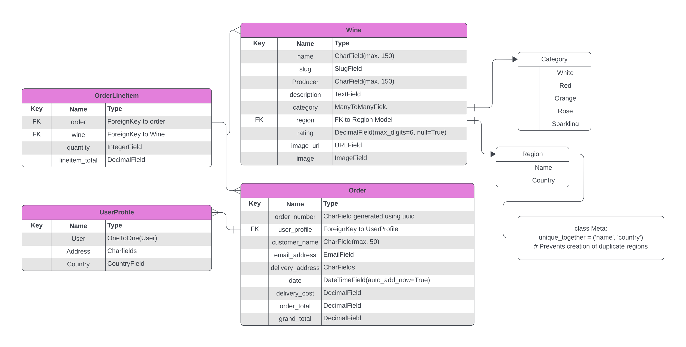

**Table of contents:**

- [Introduction](#introduction)
- [Deployed Site](#deployed-site)
- [User Experience](#user-experience)
  - [Design](#design)
  - [Entity Relationship Diagram](#entity-relationship-diagram)
  - [Wireframes](#wireframes)
- [User Stories](#user-stories)
  - [Visitor and Customer User Stories](#visitor-and-customer-user-stories)
  - [Site Admin User Stories](#site-admin-user-stories)
- [Features](#features)
  - [Data Model](#data-model)
  - [Further Development and Future Features](#further-development-and-future-features)
- [Testing and Validation](#testing-and-validation)
  - [W3C HTML and CSS Validation](#w3c-html-and-css-validation)
  - [JSHint Code Analysis](#jshint-code-analysis)
  - [Manual Testing Methodology](#manual-testing-methodology)
  - [Bugs and Challenges](#bugs-and-challenges)
  - [Development](#development)
  - [Contributing](#contributing)
  - [Deployment](#deployment)
- [Technologies Used](#technologies-used)
- [Acknowledgements](#acknowledgements)

## Introduction

## Deployed Site

The program has been deployed to Heroku and can be accessed [here](https://pp5ecommerce-a72d5065ca06.herokuapp.com/).

## User Experience

### Design

#### Colour

#### Typography

### Entity Relationship Diagram

This Entity-Relationship Diagram (ERD) provides a visual representation of the key models and relationships between them in the system. Below this diagram is breakdown of these entities and their relationships.

**Main Entities and Relationships**

User:
1. Represents the system's registered users.
1. Each user has one associated UserProfile.
1. Users can place multiple Orders.

UserProfile:
1. Extends the default User model with additional fields for storing delivery information and order history.
1. Maintains default delivery information like phone number, address, city, and country.
1. One-to-One relationship with the User model, meaning each user has exactly one profile, and each profile belongs to one user.

Product:
1. Represents individual products available for purchase.
1. Products are referenced in OrderLineItems when included in an order.

Order:
1. Stores details about an order placed by a user.
1. Includes delivery information such as the full name, phone number, address, and country.
1. Contains details like the total cost of the order and delivery charges.
1. One-to-Many relationship with OrderLineItem, meaning each order can contain multiple products (line items).

OrderLineItem:
1. Represents a specific product within an order.
1. Each OrderLineItem belongs to one Order.
1. Contains details about the product, quantity, and the total cost for that item.

Region:
1. Represents geographical wine-producing regions, such as Bordeaux or Napa Valley.
1. One-to-Many relationship with the Wine model, where a region can produce multiple wines.

Wine:
1. Represents individual wines available for purchase.
1. Linked to Region via a ForeignKey, meaning each wine is produced in one region.
1. Linked to Category via a ManyToManyField, meaning each wine can belong to multiple categories (e.g., Red, Sparkling).

Category:
1. Represents the different types of wine categories, such as Red, White, or Sparkling.
1. Many-to-Many relationship with Wine, meaning a wine can belong to multiple categories, and a category can have multiple wines.

**Relationships Summary**

* User: One-to-One with UserProfile.

* UserProfile: One-to-One with User.

* Order: Many-to-One with UserProfile, and One-to-Many with OrderLineItem.

* OrderLineItem: Many-to-One with Order, and Many-to-One with Product.

* Wine: Many-to-One with Region, and Many-to-Many with Category.

* Region: One-to-Many with Wine.

* Category: Many-to-Many with Wine.

### Wireframes

Wireframes were developed at the outset of the project to visualize the site's layout and prioritise mobile-first design. These wireframes ensured that content would be accessible and optimized across all screen sizes, providing a seamless experience for visitors on any device.

Each wireframe link presents mock-ups for the corresponding pages, showcasing their appearance on desktop, tablet, and mobile devices.

<a href='/documentation/wireframes/HomepageWireframes.pdf'>Homepage Wireframes</a>

<a href='/documentation/wireframes/ProductPageWireframes.pdf'>Product Page Wireframes</a>

<a href='/documentation/wireframes/ProductInfoWireframes.pdf'>Product Info Page Wireframes</a>

<a href='/documentation/wireframes/ShoppingCartWireframes.pdf'>Shopping Cart Wireframes</a>

<a href='/documentation/wireframes/CheckoutWireframes.pdf'>Checkout Page Wireframes</a>

<a href='/documentation/wireframes/ProfilePageWireframes.pdf'>User Profile Page Wireframes</a>

## User Stories

A GitHub Projects kanban board tracking progress of the following User Stories can be found [here](https://github.com/users/klchambers/projects/3).

### Visitor/Customer User Stories

1: As a visitor I would like to view a list of products available for purchase

Acceptance Criteria:
* I can view a list of all wines.
* I can filter wines by categories (e.g., red, white, sparkling).
* I can search for a specific wine by name or region.

2: As a customer, I want to view detailed information about a specific wine so that I can make an informed purchasing decision.

Acceptance Criteria:
* I can view the name, categories, price, description, and origin of a wine.
* I can view customer reviews and ratings for the wine.
* I can view an image of the wine bottle.

3: As a customer, I want to add wines to my shopping cart so that I can review and purchase them later.

Acceptance Criteria:

* I can add one or more wines to my shopping cart.
* I can specify the quantity of each wine I want to add.
* I can view my cart with all selected wines, their quantities, and the total price.
* I can remove wines from my cart or change their quantities.

4: As a customer, I want to create an account so that I can manage my orders and personal information.

Acceptance Criteria:

* I can sign up for an account by providing my email, password, and personal information.
* I can log in and log out of my account.
* I can recover my password if I forget it.

5: As a customer, I want to save wines to my wishlist so that I can purchase them later.

Acceptance Criteria:

* I can add wines to a wishlist.
* I can view my wishlist and remove items if I change my mind.
* I can move items from my wishlist to my shopping cart.

6: As a customer, I want to checkout and complete my purchase so that I can receive my selected wines.

Acceptance Criteria:

* I can review my shopping cart before proceeding to checkout.
* I can enter my shipping address and billing information.
* I can see a confirmation of my order, including an order number.

7: As a customer, I want to receive an email confirmation of my order so that I have a record of my purchase.

Acceptance Criteria:

* After completing the purchase, I receive an email with details about my order.
* The email includes an order number, summary of items, shipping address, and estimated delivery time.

8: As a customer, I want to track the status of my order so that I know when to expect delivery.

Acceptance Criteria:

* I can view my order status (e.g., pending, shipped, delivered) in my account.
* I receive notifications or emails when the status of my order changes.

9: As a customer, I want to leave a review for a wine I purchased so that I can share my experience with other customers.

Acceptance Criteria:

* I can rate the wine on a scale from 1 to 5 stars.
* I can write a review with my comments and feedback.
* My review is visible to other customers after submission.

10: As a customer, I want to manage my account details so that I can update my personal information.

Acceptance Criteria:

* I can update my email, password, shipping address, and billing information.
* I can view my order history and see the status of each order.

### Site Admin User Stories

11: As an admin, I want to manage the wine inventory so that I can keep the product catalog updated.

Acceptance Criteria:

* I can add, edit, or delete wines from the product catalog.
* I can upload or change images for wines.
* I can manage categories and regions for filtering.

12: As an admin, I want to view customer orders so that I can process and update their status.

Acceptance Criteria:

* I can view a list of all orders, including customer information, order status, and items.
* I can update the status of an order (e.g., shipped, delivered).
* I can search for orders by customer name or order number.

13: As an admin, I want to view customer reviews so that I can moderate or delete inappropriate content.

Acceptance Criteria:

* I can view all submitted reviews.
* I can delete reviews that violate the terms of service.
* I can filter reviews by wine or customer.

## Features

### Data Model

### Further Development and Future Features

## Testing and Validation

### W3C HTML and CSS Validation

#### HTML

HTML validation of individual pages can be viewed in the drop down boxes below:

Homepage

 

#### CSS

### JSHint Code Analysis

JSHint Code Analysis Screenshot

 

### Manual Testing Methodology

### Bugs and Challenges

## Development and Deployment

### Development

### Contributing

To contribute, make a pull request from the [project repository](https://github.com/klchambers/pp5ecommerce). When merged, any changes will be reflected following the next Heroku deployment of the project.

### Deployment

#### Prerequisites
* Heroku Account: Ensure you have an active Heroku account. You can sign up at Heroku.
* Heroku CLI: Install the Heroku Command Line Interface (CLI) on your local machine. Instructions for installation can be found here.
* Git: Ensure Git is installed and configured on your local machine. Instructions for installation can be found here.
* PostgreSQL Database: The application uses a PostgreSQL database. You can use Heroku's PostgreSQL add-on or an external provider like Neon.

#### Steps to Deploy

1. Clone the Repository

`git clone https://github.com/klchambers/pp5ecommerce.git`

`cd pp5ecommerce`

2. Create a Virtual Environment and Install Dependencies

`python -m venv venv`

`source venv/bin/activate`, or on Windows use `venv\Scripts\activate`

`pip install -r requirements.txt`

3. Set Up Environment Variables

Create an env.py file in the root directory and add the following environment variables:

`import os`

`os.environ.setdefault('DATABASE_URL', <your_database_url>)`

`os.environ.setdefault('SECRET_KEY', <your_database_url>)`

(note: Add .env.py/env.py to .gitignore and save before pushing your code to Github. This will prevent sensitive information from being made publicly available)

In the project's settings.py file, import your database URL and secret key:

`if os.path.isfile('env.py'):
    import env`

`SECRET_KEY = os.environ.get('SECRET_KEY')`

Add `.herokuapp.com` to ALLOWED_HOSTS

4. Prepare Static Assets

`python manage.py collectstatic`

5. Initialize a Git Repository

`git init`

`git add .`

`git commit -m "Initial commit"`

6. Create a Heroku App

`heroku create <'your app name'>`

7. Deploy to Heroku

`git push heroku main`

8. Apply DB migrations

`python3 manage.py makemigrations`

`python3 manage.py migrate`

9. Create a Superuser

`python manage.py createsuperuser`

Follow the instructions in your terminal to create your superuser account username and passwords

10. Open the application

`heroku open`

## Technologies Used

* [**Django**](https://www.djangoproject.com): Python framework for templating, URL routing, admin interface, and more
* [**Visual Studio Code**](https://code.visualstudio.com/): Text editor for development
* [**Heroku**](https://www.heroku.com): Live deployment of web app
* [**Balsamiq**](https://balsamiq.com/wireframes/): Wireframing tool used to create UI mock-ups at project outset

## Acknowledgements
* Homepage landing [image](https://www.pexels.com/photo/wine-glass-bottle-87224/) by [Timur Saglambilek](https://www.pexels.com/@marketingtuig/) on [Pexels](https://www.pexels.com/)

* Use of Slugify to generate and save slugs adapted from code posted by [Ikechukwu Henry Odoh](https://stackoverflow.com/users/2261257/ikechukwu-henry-odoh) in [this](https://stackoverflow.com/questions/50436658/how-to-auto-generate-slug-from-my-album-model-in-django-2-0-4) Stack Overflow thread
