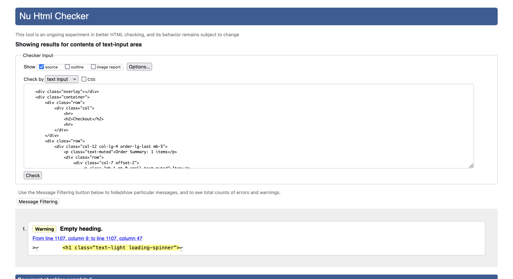
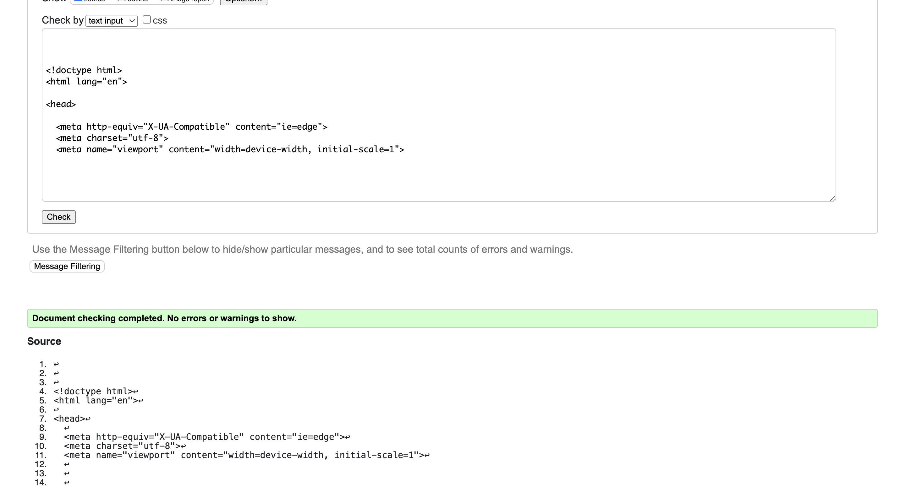

**Table of contents:**

- [Introduction](#introduction)
- [Deployed Site](#deployed-site)
- [User Experience](#user-experience)
  - [Wireframes](#wireframes)
  - [Features](#features)
  - [Design](#design)
  - [Data Model](#data-model)
- [Epics and User Stories](#epics-and-user-stories)
- [Business Model](#business-model)
- [Testing and Validation](#testing-and-validation)
  - [W3C HTML and CSS Validation](#w3c-html-and-css-validation)
  - [JSHint Code Analysis](#jshint-code-analysis)
  - [Manual Testing Methodology](#manual-testing-methodology)
  - [Bugs and Challenges](#bugs-and-challenges)
  - [Development](#development)
  - [Contributing](#contributing)
  - [Further Development and Future Features](#further-development-and-future-features)
  - [Deployment](#deployment)
- [Technologies Used](#technologies-used)
- [Acknowledgements](#acknowledgements)

## Introduction

GlouGlou Wine Store is a mobile-first e-commerce web application built with Django for a natural wine webshop.

The project emphasizes responsive design to ensure a smooth user experience across all devices. It provides a seamless registration, shopping, and checkout experience for customers, with intuitive product management for admins. Integration of Stripe ensures secure and simple transactions, and the application is deployed on Heroku making the platform accessible from anywhere.

## Deployed Site

The program has been deployed to Heroku and can be accessed [here](https://pp5ecommerce-a72d5065ca06.herokuapp.com/).

## User Experience

## Features

#### Homepage

On the homepage, the visitor is met with a landing hero image, with a tagline and prominent button to enter the shop.

A distinctive logo at the top of the page lets them know that they are visiting GlouGlou, a webshop specialising in natural and biodynamic wines.

In the navbar, the user can search for products in the search field, register/login/logout through 'my account', enter the shop, view their shopping bag, go to the blog, FAQs, or signup to the newsletter.

If logged out, the user can log in or register for an account via the buttons in the 'My Account' drop down menu.

When registering for an account, a confirmation email will be sent to the email address provided.

Please note that the initial email may be directed to your spam folder. This can happen due to several factors:

- New Sender Recognition: If this is the first time you are receiving an email from GlouGlou, your email provider might not immediately recognize it as safe.
- Email Filtering: Gmail and other providers have advanced spam detection systems that may mistakenly flag the confirmation email as unsolicited, especially if it's sent from an automated system.
- First-Time Communication: As the first email from our domain, the provider may treat it more cautiously, categorizing it as spam.
To ensure you receive the confirmation and future emails, please check your spam folder, and mark the email as 'Not Spam,'.

#### Newsletter signup

When 'Newsletter' is selected in the navbar, a modal appears prompting the user to add their email address to subscribe to the GlouGlou newsletter.

The 'Cancel Newsletter Signup' button dismisses the modal with no other action.

By entering their email address and clicking 'subscribe', the user's email address is sent to mailchimp and returns an 'opt-in' confirmation to their inbox

The user can confirm that they wish to subscribe to the newsletter, they will then be redirected to the homepage, with the below subscription confirmation sent to their inbox. If desired, they can manage their preferences or unsubscribe from the list by pressing the 'Unsubscribe' button.

Please note that sign up verification and confirmation emails may be directed to your spam folder.

#### Product Page

Selecting 'Shop' from the navbar takes the user to the products page, displaying all products with relevant information/images (with a path to a default 'noimage.png' if no image is found).

By using the filter/sorts options on the left, they can sort by price (ascending or descending), or filter by region or style. Reset filters resets the page to remove selected filters and show all products.

#### Product Information

Clicking on a wine brings up that wine's product_info page. Here, a high-resolution image of the product is provided, with a product description and other information.

'Wine' object attributes are iterated through and printed if available to give the shopper more information about the region, winemaker, and grape varieties in that particular wine.

If the logged in user is a superuser, additional options to edit the product or delete it are made available.

'Edit' calls an edit_product view where fields can be edited, while 'Delete' brings up a modal, through which the user can confirm that they wish to delete the product, or to cancel this operation.

The user can add the product (of their chosen quantity) to their bag, or return to the products page via the buttons at the bottom of the page. Toasts are used to inform the user of a successful addition, along with a summary of the contents of their bag.

They can dismiss this toast with the close button in the top-right, or continue to bag and checkout with the 'Go to Checkout' button in the bottom left of the toast.

#### Shopping Bag

By clicking the 'Go to Checkout' button in the aforementioned toast, or by clicking the bag icon in the navbar, the user is taken to their shopping bag.

This shows a summary of items they have added to their bag, with additional information on each product, along with a subtotal and delivery fees.

At the bottom of this page they can choose to return to products, or continue to checkout via the buttons at the bottom of the page.

#### Checkout

When proceeding to Checkout, the user sees a summary of products and costs to check that their order is correct, and any delivery information saved to their profile will be auto-filled in the form on the left.

Once delivery information and card details are entered, a payment processing overlay displays to give feedback to the user that payment is in process.

Any Stripe elements for confirmation/verification are presented above this overlay to ensure that the user does not miss any important information. The green spinner overlay is present until the payment is processed. Webhooks ensure that all orders are saved to the database even if this page is accidentally or intentionally closed etc during processing.

The user is then shown their order confirmation, with an order confirmation sent to their email address.

Feedback for both successful/unsuccessful orders is given to the user in the form of Bootstrap toasts. Successful orders show the user's order number while unsuccessful order toasts present any relevant error message to the user and invites them to try the form again.

#### User Profile

If logged in, a user can view their profile page. Here they can view a summary of past orders (clicking on the highlighted order number takes them to their original order confirmation generated at the order's creation), and default delivery information.

If completed and saved, this delivery information will be automatically filled out for the user at future checkouts.

#### Product Administration: Create products

If logged in as a superuser, an option for 'Product Management' comes available under the 'My Profile' section of the navbar.

Here a superuser can create new products, with Cloudinary image field submission, product descriptions, names, and prices without a need to log into the Django admin panel.

#### Blog

Clicking the 'blog' button in the navbar directs the user to a list of published blog posts. Some blog post details (25 word summary, post date, title, and author) are provided as well as a featured image for illustative purposes

Clicking the 'Read Post' beneath an article takes the user to the full blog post. At the end of the post is a convenient 'Return to Blog' button to allow the user to easily navigate back to the full list of blog posts.

Through the admin panel, site staff can view and published and draft blog posts.

Editing or creating a blog post allows the site admin to input a title, author, and blog content, and upload featured image (hosted via Cloudinary). 'Status' is 'Draft' by default, and blog posts are only visible to visitors to the site when they are set to 'Published' and saved.

#### FAQs

The FAQ page displays published questions and answers along the left-hand side. Logged in users are able to submit a question (with a 254 character limit). Users who are not logged in/authenticated are informed that they must be logged in in order to submit a question

When a new question is submitted, all admins are notified via email to their registered email address. They are prompted to access the site's admin panel to respond or to answer the user directly via the user's email address.

In the admin panel, site staff can view questions, input their answer in the 'answer field, and select 'publish' before saving. This sets the 'status' Boolean to 1 (published) and displays the question and answer on the FAQs page.

When the question is answered and published to FAQs, the user who submitted this question is notified via email and directed to the FAQs page via the link as shown below.

### Wireframes

Wireframes were developed at the outset of the project to visualise the site's layout and prioritise mobile-first design. These wireframes ensured that content would be accessible and optimised across all screen sizes, providing a seamless experience for visitors on any device.

Each wireframe link presents mock-ups for the corresponding pages, showcasing their appearance on desktop, tablet, and mobile devices.

<a href='/documentation/wireframes/HomepageWireframes.pdf'>Homepage Wireframes</a>

<a href='/documentation/wireframes/ProductPageWireframes.pdf'>Product Page Wireframes</a>

<a href='/documentation/wireframes/ProductInfoWireframes.pdf'>Product Info Page Wireframes</a>

<a href='/documentation/wireframes/ShoppingCartWireframes.pdf'>Shopping Cart Wireframes</a>

<a href='/documentation/wireframes/CheckoutWireframes.pdf'>Checkout Page Wireframes</a>

<a href='/documentation/wireframes/ProfilePageWireframes.pdf'>User Profile Page Wireframes</a>

### Design

#### Colour

The Natural Wine Store's color palette is vibrant and fresh, creating a modern and welcoming atmosphere while reflecting the essence of natural wines. The selected colors work together to establish a clean, minimalistic look with dynamic accents. Here's a breakdown of the color scheme:

Logo Colors:

* Mint Green (#01BF62): A bright, refreshing green that represents the organic and fresh nature of the wine.

* Coral Red (#FF5757): A bold and energetic red used to add vibrancy and passion to the brand, reflecting the lively character of natural wines.

Background Colors:
* Light Grey (#F0F0F0)  and White (#FFFFFF): These neutral tones are used for page backgrounds, providing a clean and minimal canvas that allows the vibrant product imagery and other elements to stand out.

Button Colors:
* Deep Green (#198753): Used for positive actions such as "Add to Cart" or "Buy Now" buttons, this strong, natural green aligns with the store's organic theme while encouraging action.

* Crimson Red (#DC3444): This red is used for negative actions or alerts, such as "Remove" or "Cancel" buttons, ensuring clarity and immediate recognition for the user.

#### Typography

The Natural Wine Store’s typography, centered around Rubik, selected  for its readability and modern style. It's featured in body text, product descriptions, and navigational elements. The geometric and rounded characteristics of Rubik pair well with the color scheme to create a friendly and contemporary aesthetic, that is clean, modern, and approachable.

Button text is styled in Rubik for readability and to ensure clear calls to action. The button text contrasts with the button colors (#198753 and #DC3444) for visual prominence.

Text Sizing and Spacing:
Body text is set at 16px–18px for optimal legibility, with generous line spacing to ensure comfortable reading across various devices.
This typography choice, in conjunction with the color palette, creates a seamless user experience that feels both natural and modern.

### Data Model

This Entity-Relationship Diagram (ERD) provides a visual representation of the key models and relationships between them in the system. Below this diagram is breakdown of these entities and their relationships.

**Main Entities and Relationships**

User

1. Represents the system's registered users.
1. Each user has one associated UserProfile.
1. Users can place multiple Orders.

UserProfile

1. Extends the default User model with additional fields for storing delivery information and order history.
1. Maintains default delivery information like phone number, address, city, and country.
1. One-to-One relationship with the User model, meaning each user has exactly one profile, and each profile belongs to one user.

Product

1. Represents individual products available for purchase.
1. Products are referenced in OrderLineItems when included in an order.

Order

1. Stores details about an order placed by a user.
1. Includes delivery information such as the full name, phone number, address, and country.
1. Contains details like the total cost of the order and delivery charges.
1. One-to-Many relationship with OrderLineItem, meaning each order can contain multiple products (line items).

OrderLineItem

1. Represents a specific product within an order.
1. Each OrderLineItem belongs to one Order.
1. Contains details about the product, quantity, and the total cost for that item.

Region

1. Represents geographical wine-producing regions, such as Alsace, France or Piedmont, Italy.
1. One-to-Many relationship with the Wine model, where a region can produce multiple wines.

Wine

1. Represents individual wines available for purchase.
1. Linked to Region via a ForeignKey, meaning each wine is produced in one region.
1. Linked to Category via a ManyToManyField, meaning each wine can belong to multiple categories (e.g., Red, Sparkling).

Category

1. Represents the different types of wine categories, such as Red, White, or Sparkling.
1. Many-to-Many relationship with Wine, meaning a wine can belong to multiple categories, and a category can have multiple wines.

 

**Relationships Summary**

* User: One-to-One with UserProfile.

* UserProfile: One-to-One with User.

* Order: Many-to-One with UserProfile, and One-to-Many with OrderLineItem.

* OrderLineItem: Many-to-One with Order, and Many-to-One with Product.

* Wine: Many-to-One with Region, and Many-to-Many with Category.

* Region: One-to-Many with Wine.

* Category: Many-to-Many with Wine.

## Epics and User Stories

A GitHub Projects kanban board tracking progress of the following Epics and User Stories can be found [here](https://github.com/users/klchambers/projects/3/views/7).

**Epic 1:** *Product Browsing and Information*

As a visitor or customer, I want to explore and find wines that match my preferences so that I can make informed purchasing decisions.

**Epic 2:** *Shopping Cart and Wishlist Management*

As a customer, I want to add wines to my cart or wishlist, manage quantities, and move between these lists so that I can easily manage my potential purchases.

**Epic 3:** *Customer Account Management*

As a customer, I want to create and manage an account to save my preferences, manage orders, and update personal details.

**Epic 4:** *Checkout and Order Management*

As a customer, I want to complete purchases and track my orders so that I can receive my wines and stay informed on their delivery status.

**Epic 5:** *Customer Reviews and Feedback*

As a customer, I want to leave and view reviews and ratings for wines so that I can share my experience and help other customers make decisions.

**Epic 6:** *Admin Wine Inventory and Catalog Management*

As an admin, I want to manage the wine catalog so that I can keep the product offerings accurate and up to date.

**Epic 7:** *Admin Order and Customer Review Management*

As an admin, I want to manage customer orders and moderate reviews to ensure smooth order processing and maintain content quality.

## Business Model
### Introduction
GlouGlou Wine Store is an e-commerce platform designed for wine enthusiasts to explore, select, and purchase wines from different regions, varieties, and categories. The business aims to provide a smooth, customer-focused online shopping experience with curated wine selections, user ratings, and reviews, as well as seamless order management.
### Value Proposition
GlouGlou Wine Store offers a user-friendly online platform for wine buyers to:
* Access a curated catalog of wines, filtered by categories such as region, type, and price.
* Get detailed product descriptions, images, and product details.
* Manage their shopping experience with personalised accounts and order details.
* Benefit from convenient, secure checkout processes using Stripe integration, and receive timely order confirmations.
### Target Audience
The target customers for GlouGlou Wine Store are:
* Wine enthusiasts who enjoy natural wines and diverse wine selections.
* Casual consumers seeking convenient online wine shopping experiences.
### Revenue Model
The primary source of revenue for GlouGlou Wine Store is through product sales:
* Direct sales of wines: Customers purchase wines directly from the online store.

Customer Acquisition Channels

To drive traffic and conversions, GlouGlou Wine Store uses several customer acquisition strategies:
1. Search Engine Optimization (SEO): Ensuring the store ranks highly on search engines for key terms like "online wine store" or "best wines for delivery."
2. Social Media Marketing: Engaging customers through platforms like Instagram and Facebook, showcasing wine selections, reviews, and customer testimonials.
3. Email Marketing: Building a subscriber list for sending out newsletters with special offers, new arrivals, and wine recommendations.
### Key Resources
GlouGlou Wine Store relies on several essential resources:
* Product catalog: A well-curated inventory of high-quality wines from diverse regions.
* E-commerce platform: Built using technologies like Django for the backend, integrated with payment systems like Stripe for secure transactions.
* Marketing and branding: A strong brand presence through digital marketing efforts, social media, and engaging with the wine community.
### Customer Relationship
GlouGlou Wine Store focuses on building strong relationships with its customers through:
* Personalised account management: Customers can create profiles to save details, manage orders, and track purchases.
### Future Growth and Expansion
GlouGlou Wine Store aims to expand its services by:
* Offering subscription services: Implementing a monthly wine box delivery based on customer preferences.
* Add-ons and subscriptions: Customers can opt into special wine bundles, subscription services for regular deliveries, or limited-time seasonal offers.
* Loyalty programs: Creating loyalty rewards for repeat customers, offering discounts or early access to new products.
* Product ratings, reviews, and personalised recommendations: Recommend highly rated products, or similar products based on returning customer’s previous order history
* Social Media content marketing, gaining a subscriber list and new customers with social media posts showcasing winemakers, regions, new arrivals and special offers.
### Conclusion
The GlouGlou Wine Store business model is centred around delivering a premium wine shopping experience, focusing on customer satisfaction through a curated selection, easy-to-use e-commerce platform, and personalised services. The company has the potential to grow through targeted marketing, strategic partnerships, and the introduction of new features to enhance the customer experience.

## Testing and Validation

### W3C HTML and CSS Validation

#### HTML

HTML validation of individual pages can be viewed in the drop down boxes below:

Homepage

 

Products

 

Product Info

 

An error returned while validating product_info.html. On closer inspection this appears to stem from formatted text rendered by the Summernote textfield used for formatting product descriptions

Bag

 

Checkout

 
An error was reported on the page source for /checkout.html relating to the use of placeholder text for the 'Country' field, as well as a warning for an Empty h1 tag.
It was deemed appropriate to keep these as is, as the placeholder text provides important information to the user relating to a mandatory field, and the empty h1 tag is for a decorative spinner appearing on the payment processing overlay.

User Profile

 

#### CSS

GlouGlou's CSS passed the W3C Jigsaw Css Validator with no issues. Results can be found [here](https://jigsaw.w3.org/css-validator/validator?uri=https%3A%2F%2Fpp5ecommerce-a72d5065ca06.herokuapp.com%2F&profile=css3svg&usermedium=all&warning=1&vextwarning=&lang=en).

### JSHint Code Analysis

JavaScript passed JSHint Code analysis tool with no issues found. Results can be viewed below.

JSHint Code Analysis Screenshot

 

### Manual Testing Methodology

| **Test ID**   | **Feature**                  | **Test Case**                                                                                                              | **Expected Result**                                                                                                                                                          |
|---------------|------------------------------|---------------------------------------------------------------------------------------------------------------------------|------------------------------------------------------------------------------------------------------------------------------------------------------------------------------|
| **AUTH-001**  | **User Authentication**       | Register a new user via the registration form.                                                                          | Registration email received to specified email address. Once link in email is followed, the user is successfully created, and the user is logged in and redirected to the homepage.                                                                               |
| **AUTH-002**  |                              | Attempt to register with invalid email/password.                                                                         | User is shown appropriate error messages, and registration fails.                                                                                                             |
| **AUTH-003**  |                              | Log in with valid credentials.                                                                                           | User is successfully logged in and redirected to the homepage.                                                                                              |
| **AUTH-004**  |                              | Log in with invalid credentials.                                                                                         | User is shown an error message, and login fails.                                                                                                                              |
| **AUTH-005**  |                              | Check that an unauthenticated user can checkout as a guest.                                                              | Guest checkout works as expected, with the user asked for shipping and payment information without requiring login.                                                           |
| **AUTH-006**  |                              | Check that an authenticated user can view their order history.                                                           | Authenticated user should be able to see past orders and order details.                                                                                                       |
| **CART-001**  | **Cart/Bag Functionality**    | Add items to the cart as an authenticated user.                                                                          | Items are successfully added to the cart, and the cart page shows the correct items, quantities, and total price.                                                             |
| **CART-002**  |                              | Remove items from the cart.                                                                                              | Items are successfully removed, and the cart is updated.                                                                                                                      |
| **CART-003**  |                              | Modify the quantity of items in the cart.                                                                                | Quantity of items is updated, and the total price adjusts accordingly.                                                                                                       |
| **CART-004**  |                              | Add items to the cart as a guest user.                                                                                   | Guest users should be able to add items to the cart without logging in.                                                                                                       |
| **CART-005**  |                              | Clear the cart as a guest user and authenticated user.                                                                   | Cart should be empty after clearing, and users should receive a confirmation message.                                                                                         |
| **ORDER-001** | **Order Management**         | Complete a checkout process as a guest user.                                                                             | Guest users can place orders without creating an account, and they should receive an order confirmation email.                                                                |
| **ORDER-002** |                              | Complete a checkout process as an authenticated user.                                                                    | Authenticated users can place orders, and the order is visible in their order history. They should receive a confirmation email with order details.                            |
| **ORDER-003** |                              | Modify default delivery information for authenticated users.                                                             | Users can change their default delivery information, and the changes are saved and reflected in the next order they place.                                                    |
| **ORDER-004** |                              | Check that orders are saved and viewable in the user’s past orders.                                                      | The past orders section shows all previously placed orders with details such as items purchased, total cost, and delivery address.                                             |
| **CHECKOUT-001** | **Checkout Process**      | Try to checkout without filling in required fields (e.g., address, payment method).                                       | Form validation messages should appear under the fields indicating what is missing or invalid.                                                                                 |
| **CHECKOUT-002** |                           | Try an unsuccessful checkout with an invalid payment method.                                                             | An error message should be displayed to the user, indicating the issue with the payment method, and the checkout should not be processed.                                      |
| **CHECKOUT-003** |                           | Successfully checkout after filling all required fields.                                                                 | The order should be successfully processed, and the user should be redirected to a confirmation page with a toast message confirming the order.                               |
| **ADMIN-001** | **Admin - Product Management**| Log in as an admin user and create a new product.                                                                 | The new product is successfully created and appears in the product listing page, with all relevant details such as name, category, price, and image.                           |
| **ADMIN-002** |                              | Edit an existing product as an admin user.                                                                               | The product details should be updated accordingly, and the changes should be reflected across the site.                                                                       |
| **ADMIN-003** |                              | Delete a product as an admin user.                                                                                       | The product should be removed from the product listing page, and attempting to access the product’s page should result in a 404 error or a message that the product is removed. |
| **SEARCH-001**| **Search Functionality**      | Use the search bar to find a specific product by name.                                                                   | The relevant product(s) should appear in the search results, showing the name, price, and other key details.                                                                  |
| **SEARCH-002**|                              | Search for a product by partial name.                                                                                    | Products matching the partial name should be displayed in the results, allowing for flexible searching.                                                                       |
| **SEARCH-003**|                              | Search for a product that does not exist.                                                                                | A message should be displayed indicating no products were found for the search query.                                                                                         |
| **SEARCH-004**|                              | Search for products as a guest user.                                                                                     | Search functionality should work the same for both guest and authenticated users.                                                                                             |
| **TOAST-001** | **Toast Notifications**       | Add a product to the cart as an authenticated user and guest user.                                                       | A success toast notification should appear indicating the product was added to the cart.                                                                                      |
| **TOAST-002** |                              | Complete a successful checkout.                                                                                          | A toast notification should appear confirming the order was placed successfully.                                                                                              |
| **TOAST-003** |                              | Update user details such as delivery information.                                                                        | A success toast notification should confirm that the user details were updated successfully.                                                                                  |
| **EMAIL-001** | **Order Confirmation**       | Place an order and verify that a confirmation email is sent to both guest and authenticated users.                       | An order confirmation email should be sent immediately after an order is placed, containing the order number, summary of the order, and delivery information.                  |

### Bugs and Challenges

* Cloudinary API URL was incorrectly input in the Heroku config variables, resulting in the following error: `ValueError: Must supply api_key`.
This was amended by double checking API keys stored in env.py for localhost, and config variables in the projects Heroku settings

* A change to Stripe `payment_intent` objects (in a [2022 update](https://docs.stripe.com/changelog/2022-11-15/removes-charges-attribute-paymentintent) they stopped returning a `charges` attribute) resulted in webhooks returning with a 500 server error.
This issue was solved by assigning retrieving this object and assigning it to a variable as follows: `stripe_charge = stripe.Charge.retrieve(intent.latest_charge)`

* Incorrect configuration of crispy_forms for Bootstrap5 returned TemplateNotFound errors when returning certain views with forms. Make sure that both `django-crispy-forms` and `crispy_bootstrap5` are installed with the following configuration in settings.py:

  *  INSTALLED_APPS = [
    ...
    'crispy_forms',
    'crispy_bootstrap5',
    ...
]

      CRISPY_ALLOWED_TEMPLATE_PACKS = "bootstrap5"
      CRISPY_TEMPLATE_PACK = "bootstrap5"

* If an admin added an item to their bag and then deleted the product from the database, a 500 Internal Server Error would occur because the object no longer existed.

  This issue was addressed in two ways:
  * In the delete_product view: The session bag is checked to see if the product ID exists. If the admin attempts to delete a product that is in their bag, they are redirected to the shopping bag page. A modal informs them that they need to remove the item from their bag before deleting the product.
  * In bag_contents() (bag/contexts.py): A try/except block handles missing products. If a product in the session bag has been deleted from the database, the product ID is removed from the session bag. The user is notified with an error message stating that the item was removed from their bag.

## Development and Deployment

### Contributing

To contribute, make a pull request from the [project repository](https://github.com/klchambers/pp5ecommerce). When merged, any changes will be reflected following the next Heroku deployment of the project.

### Further Development and Future Features

### Deployment

#### Prerequisites
* Heroku Account: Ensure you have an active Heroku account. You can sign up at Heroku.
* Heroku CLI: Install the Heroku Command Line Interface (CLI) on your local machine. Instructions for installation can be found here.
* Git: Ensure Git is installed and configured on your local machine. Instructions for installation can be found here.
* PostgreSQL Database: The application uses a PostgreSQL database. You can use Heroku's PostgreSQL add-on or an external provider like Neon.

#### Steps to Deploy

1. Clone the Repository

`git clone https://github.com/klchambers/pp5ecommerce.git`

`cd pp5ecommerce`

2. Create a Virtual Environment and Install Dependencies

`python -m venv venv`

`source venv/bin/activate`, or on Windows use `venv\Scripts\activate`

`pip install -r requirements.txt`

3. Set Up Environment Variables

Create an env.py file in the root directory and add the following environment variables:

`import os`

`os.environ.setdefault('DATABASE_URL', <your_database_url>)`

`os.environ.setdefault('SECRET_KEY', <your_database_url>)`

(note: Add .env.py/env.py to .gitignore and save before pushing your code to Github. This will prevent sensitive information from being made publicly available)

In the project's settings.py file, import your database URL and secret key:

`if os.path.isfile('env.py'):
    import env`

`SECRET_KEY = os.environ.get('SECRET_KEY')`

Repeat for other necessary variables, e.g. Stripe API, Cloudinary, Mailchimp

Add these variables to Heroku via the Heroku Dashboard `settings > config vars`

Add `.herokuapp.com` to ALLOWED_HOSTS

4. Prepare Static Assets

`python manage.py collectstatic`

5. Initialise a Git Repository

`git init`

`git add .`

`git commit -m "Initial commit"`

6. Create a Heroku App

`heroku create <'your app name'>`

7. Deploy to Heroku

`git push heroku main`

8. Apply DB migrations

`python3 manage.py makemigrations`

`python3 manage.py migrate`

9. Create a Superuser

`python manage.py createsuperuser`

Follow the instructions in your terminal to create your superuser account username and passwords

10. Open the application

`heroku open`

## Technologies Used

* [**Django**](https://www.djangoproject.com): Python framework for templating, URL routing, admin interface, and more
* [**Visual Studio Code**](https://code.visualstudio.com/): Text editor for development
* [**Heroku**](https://www.heroku.com): Live deployment of web app
* [**Balsamiq**](https://balsamiq.com/wireframes/): Wireframing tool used to create UI mock-ups at project outset
* [**Canva**](https://www.canva.com/): Logo design
* [**Django Summernote**](https://github.com/lqez/django-summernote): HTML text editor for text fields
* [**Whitenoise**](https://whitenoise.readthedocs.io/en/stable/index.html): Static file serving
* [**Cloudinary**](https://cloudinary.com/): Media file storage
* [**Pillow**](https://pillow.readthedocs.io/en/stable/): Image processing
* [**Stripe**](https://stripe.com/ie): Payment gateway
* [**Django Crispy Forms**](https://django-crispy-forms.readthedocs.io/en/latest/): Form rendering
* [**Gmail**](https://developers.google.com/gmail/imap/imap-smtp): SMTP server for email
* [**Mailchimp**](https://mailchimp.com/): Email marketing, embedded form for newsletter signup
* [**Django-Extensions**](https://django-extensions.readthedocs.io/en/latest/): Provides additional management commands and model utilities  
* [**pydotplus**](https://pydotplus.readthedocs.io/): Python interface to Graphviz used to generate entity relationship diagrams (ERDs)  

## Acknowledgements
* Course content from Code Institute's Diploma in Full Stack Software Development has been useful in teaching programming concepts and Python methods.

* Guidance from Code Institute mentor Brian O'Hare has been invaluable throughout the stages of this project's inception and development.

* Homepage landing [image](https://www.pexels.com/photo/wine-glass-bottle-87224/) by [Timur Saglambilek](https://www.pexels.com/@marketingtuig/) on [Pexels](https://www.pexels.com/).

* Product photos author's own.

* Use of Slugify to generate and save slugs adapted from code posted by [Ikechukwu Henry Odoh](https://stackoverflow.com/users/2261257/ikechukwu-henry-odoh) in [this](https://stackoverflow.com/questions/50436658/how-to-auto-generate-slug-from-my-album-model-in-django-2-0-4) Stack Overflow thread.

* Sort By price adapted from code posted by [Prakhar](https://stackoverflow.com/users/14264497/prakhar) in [this](https://stackoverflow.com/questions/68604759/how-to-sort-product-by-price-low-to-high-and-high-to-low-in-django-with-fillters) Stack Overflow thread.

* post_save() signal in faq/signals.py adapted from code posted by [Del Margaret](https://dnmtechs.com/author/del_margaret_1154/) in [this](https://dnmtechs.com/django-post_save-signal-implementation-in-python-3-programming/) blog post.

* Product descriptions By Len Ahern & L'Atitude 51, Cork.

* Featured image for the blog post [Exploring Natural Wine in the Jura: A Journey to Authenticity](https://pp5ecommerce-a72d5065ca06.herokuapp.com/blog/post/2) courtesy of [france-voyage.com](https://www.france-voyage.com/travel-photos/jura-vineyards-1402.htm).

* Featured image for the blog post [The Bubbly Breakdown: Understanding Pét-Nat, Traditional Method, and Other Sparkling Wine Techniques](https://pp5ecommerce-a72d5065ca06.herokuapp.com/blog/post/1) courtesy of [Laker on Pexels](https://www.pexels.com/photo/sparkling-wine-on-a-clear-glass-wine-5732736/)

* [Rubik](https://fonts.google.com/specimen/Rubik) font by [Hubert & Fischer](https://hfs-studio.com/about/) used for site body content.