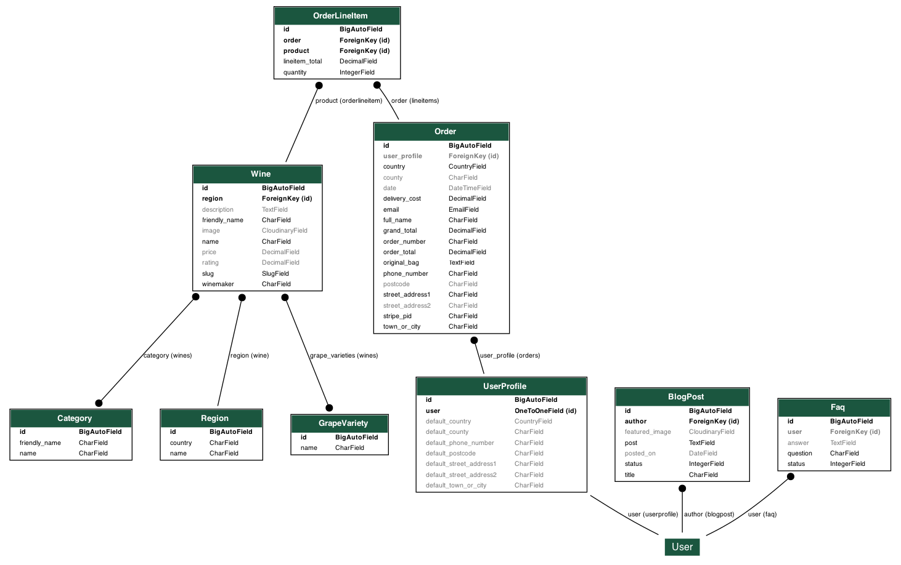

**Table of contents:**

- [Introduction](#introduction)
- [Deployed Site](#deployed-site)
- [User Experience](#user-experience)
  - [Wireframes](#wireframes)
  - [Features](#features)
  - [Design](#design)
  - [Data Model](#data-model)
- [Epics and User Stories](#epics-and-user-stories)
- [Testing and Validation](#testing-and-validation)
  - [W3C HTML and CSS Validation](#w3c-html-and-css-validation)
  - [JSHint Code Analysis](#jshint-code-analysis)
  - [Manual Testing Methodology](#manual-testing-methodology)
  - [Bugs and Challenges](#bugs-and-challenges)
  - [Development](#development)
  - [Contributing](#contributing)
  - [Further Development and Future Features](#further-development-and-future-features)
  - [Deployment](#deployment)
- [Technologies Used](#technologies-used)
- [Acknowledgements](#acknowledgements)

## Introduction

## Deployed Site

The program has been deployed to Heroku and can be accessed [here](https://pp5ecommerce-a72d5065ca06.herokuapp.com/).

## User Experience

### Wireframes

Wireframes were developed at the outset of the project to visualise the site's layout and prioritise mobile-first design. These wireframes ensured that content would be accessible and optimised across all screen sizes, providing a seamless experience for visitors on any device.

Each wireframe link presents mock-ups for the corresponding pages, showcasing their appearance on desktop, tablet, and mobile devices.

<a href='/documentation/wireframes/HomepageWireframes.pdf'>Homepage Wireframes</a>

<a href='/documentation/wireframes/ProductPageWireframes.pdf'>Product Page Wireframes</a>

<a href='/documentation/wireframes/ProductInfoWireframes.pdf'>Product Info Page Wireframes</a>

<a href='/documentation/wireframes/ShoppingCartWireframes.pdf'>Shopping Cart Wireframes</a>

<a href='/documentation/wireframes/CheckoutWireframes.pdf'>Checkout Page Wireframes</a>

<a href='/documentation/wireframes/ProfilePageWireframes.pdf'>User Profile Page Wireframes</a>

## Features

#### Homepage

#### Product Page

#### Product Information

#### Shopping Bag

#### Checkout

#### User Profile

#### User Ratings

#### Contact Us

### Design

#### Colour

#### Typography

### Data Model

This Entity-Relationship Diagram (ERD) provides a visual representation of the key models and relationships between them in the system. Below this diagram is breakdown of these entities and their relationships.

**Main Entities and Relationships**

User

1. Represents the system's registered users.
1. Each user has one associated UserProfile.
1. Users can place multiple Orders.

UserProfile

1. Extends the default User model with additional fields for storing delivery information and order history.
1. Maintains default delivery information like phone number, address, city, and country.
1. One-to-One relationship with the User model, meaning each user has exactly one profile, and each profile belongs to one user.

Product

1. Represents individual products available for purchase.
1. Products are referenced in OrderLineItems when included in an order.

Order

1. Stores details about an order placed by a user.
1. Includes delivery information such as the full name, phone number, address, and country.
1. Contains details like the total cost of the order and delivery charges.
1. One-to-Many relationship with OrderLineItem, meaning each order can contain multiple products (line items).

OrderLineItem

1. Represents a specific product within an order.
1. Each OrderLineItem belongs to one Order.
1. Contains details about the product, quantity, and the total cost for that item.

Region

1. Represents geographical wine-producing regions, such as Alsace, France or Piedmont, Italy.
1. One-to-Many relationship with the Wine model, where a region can produce multiple wines.

Wine

1. Represents individual wines available for purchase.
1. Linked to Region via a ForeignKey, meaning each wine is produced in one region.
1. Linked to Category via a ManyToManyField, meaning each wine can belong to multiple categories (e.g., Red, Sparkling).

Category

1. Represents the different types of wine categories, such as Red, White, or Sparkling.
1. Many-to-Many relationship with Wine, meaning a wine can belong to multiple categories, and a category can have multiple wines.

 

**Relationships Summary**

* User: One-to-One with UserProfile.

* UserProfile: One-to-One with User.

* Order: Many-to-One with UserProfile, and One-to-Many with OrderLineItem.

* OrderLineItem: Many-to-One with Order, and Many-to-One with Product.

* Wine: Many-to-One with Region, and Many-to-Many with Category.

* Region: One-to-Many with Wine.

* Category: Many-to-Many with Wine.

## Epics and User Stories

A GitHub Projects kanban board tracking progress of the following Epics and User Stories can be found [here](https://github.com/users/klchambers/projects/3/views/7).

**Epic 1:** *Product Browsing and Information*

As a visitor or customer, I want to explore and find wines that match my preferences so that I can make informed purchasing decisions.

**Epic 2:** *Shopping Cart and Wishlist Management*

As a customer, I want to add wines to my cart or wishlist, manage quantities, and move between these lists so that I can easily manage my potential purchases.

**Epic 3:** *Customer Account Management*

As a customer, I want to create and manage an account to save my preferences, manage orders, and update personal details.

**Epic 4:** *Checkout and Order Management*

As a customer, I want to complete purchases and track my orders so that I can receive my wines and stay informed on their delivery status.

**Epic 5:** *Customer Reviews and Feedback*

As a customer, I want to leave and view reviews and ratings for wines so that I can share my experience and help other customers make decisions.

**Epic 6:** *Admin Wine Inventory and Catalog Management*

As an admin, I want to manage the wine catalog so that I can keep the product offerings accurate and up to date.

**Epic 7:** *Admin Order and Customer Review Management*

As an admin, I want to manage customer orders and moderate reviews to ensure smooth order processing and maintain content quality.

## Testing and Validation

### W3C HTML and CSS Validation

#### HTML

HTML validation of individual pages can be viewed in the drop down boxes below:

Homepage

 

#### CSS

### JSHint Code Analysis

JSHint Code Analysis Screenshot

 

### Manual Testing Methodology

### Bugs and Challenges

## Development and Deployment

### Development

### Contributing

To contribute, make a pull request from the [project repository](https://github.com/klchambers/pp5ecommerce). When merged, any changes will be reflected following the next Heroku deployment of the project.

### Further Development and Future Features

### Deployment

#### Prerequisites
* Heroku Account: Ensure you have an active Heroku account. You can sign up at Heroku.
* Heroku CLI: Install the Heroku Command Line Interface (CLI) on your local machine. Instructions for installation can be found here.
* Git: Ensure Git is installed and configured on your local machine. Instructions for installation can be found here.
* PostgreSQL Database: The application uses a PostgreSQL database. You can use Heroku's PostgreSQL add-on or an external provider like Neon.

#### Steps to Deploy

1. Clone the Repository

`git clone https://github.com/klchambers/pp5ecommerce.git`

`cd pp5ecommerce`

2. Create a Virtual Environment and Install Dependencies

`python -m venv venv`

`source venv/bin/activate`, or on Windows use `venv\Scripts\activate`

`pip install -r requirements.txt`

3. Set Up Environment Variables

Create an env.py file in the root directory and add the following environment variables:

`import os`

`os.environ.setdefault('DATABASE_URL', <your_database_url>)`

`os.environ.setdefault('SECRET_KEY', <your_database_url>)`

(note: Add .env.py/env.py to .gitignore and save before pushing your code to Github. This will prevent sensitive information from being made publicly available)

In the project's settings.py file, import your database URL and secret key:

`if os.path.isfile('env.py'):
    import env`

`SECRET_KEY = os.environ.get('SECRET_KEY')`

Add `.herokuapp.com` to ALLOWED_HOSTS

4. Prepare Static Assets

`python manage.py collectstatic`

5. Initialise a Git Repository

`git init`

`git add .`

`git commit -m "Initial commit"`

6. Create a Heroku App

`heroku create <'your app name'>`

7. Deploy to Heroku

`git push heroku main`

8. Apply DB migrations

`python3 manage.py makemigrations`

`python3 manage.py migrate`

9. Create a Superuser

`python manage.py createsuperuser`

Follow the instructions in your terminal to create your superuser account username and passwords

10. Open the application

`heroku open`

## Technologies Used

* [**Django**](https://www.djangoproject.com): Python framework for templating, URL routing, admin interface, and more
* [**Visual Studio Code**](https://code.visualstudio.com/): Text editor for development
* [**Heroku**](https://www.heroku.com): Live deployment of web app
* [**Balsamiq**](https://balsamiq.com/wireframes/): Wireframing tool used to create UI mock-ups at project outset
* [**Django Summernote**](https://github.com/lqez/django-summernote): HTML text editor for text fields
* [**Whitenoise**](https://whitenoise.readthedocs.io/en/stable/index.html): Static file serving
* [**Pillow**](https://pillow.readthedocs.io/en/stable/): Image processing

## Acknowledgements
* Homepage landing [image](https://www.pexels.com/photo/wine-glass-bottle-87224/) by [Timur Saglambilek](https://www.pexels.com/@marketingtuig/) on [Pexels](https://www.pexels.com/)

* Use of Slugify to generate and save slugs adapted from code posted by [Ikechukwu Henry Odoh](https://stackoverflow.com/users/2261257/ikechukwu-henry-odoh) in [this](https://stackoverflow.com/questions/50436658/how-to-auto-generate-slug-from-my-album-model-in-django-2-0-4) Stack Overflow thread

* Sort By price adapted from code posted by [Prakhar](https://stackoverflow.com/users/14264497/prakhar) in [this](https://stackoverflow.com/questions/68604759/how-to-sort-product-by-price-low-to-high-and-high-to-low-in-django-with-fillters) Stack Overflow thread
